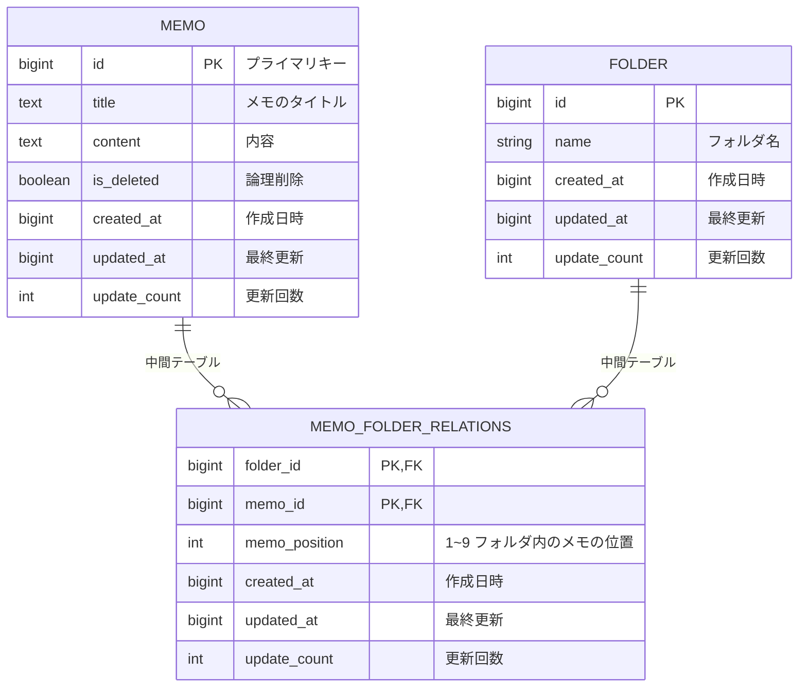

```mermaid
erDiagram
    %% テーブル間のリレーション（1対多など）
    MEMO ||--o{ MEMO_FOLDER_RELATIONS : "中間テーブル"
    FOLDER ||--o{ MEMO_FOLDER_RELATIONS : "中間テーブル"

    %% テーブルの定義
    MEMO {
        bigint id PK "プライマリキー"
        text title "メモのタイトル"
        text content "内容"
        boolean is_deleted "論理削除"
        bigint created_at "作成日時"
        bigint updated_at "最終更新"
        int update_count "更新回数"
    }

    MEMO_FOLDER_RELATIONS {
        bigint folder_id PK, FK
        bigint memo_id PK, FK
        int memo_position　"1~9 フォルダ内のメモの位置"
        bigint created_at "作成日時"
        bigint updated_at "最終更新"
        int update_count "更新回数"
    }

    FOLDER {
        bigint id PK
        string name "フォルダ名"    
        bigint created_at "作成日時"
        bigint updated_at "最終更新"
        int update_count "更新回数"
    }
```